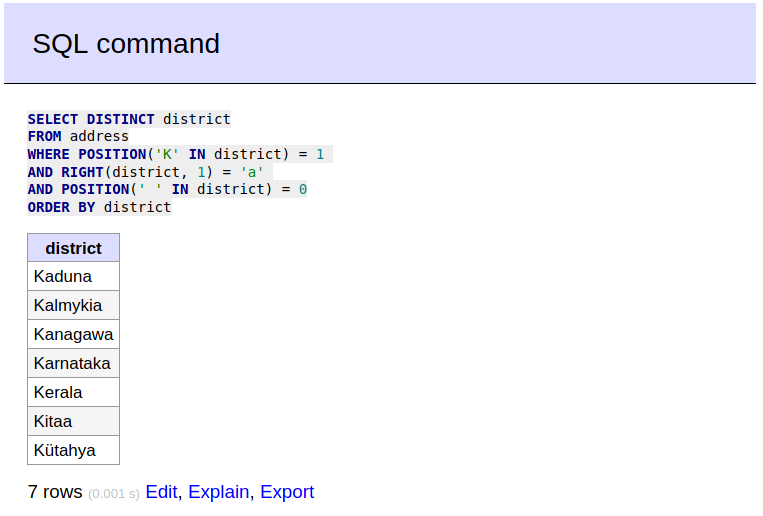
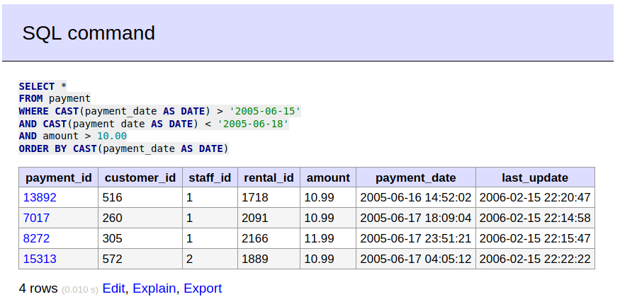
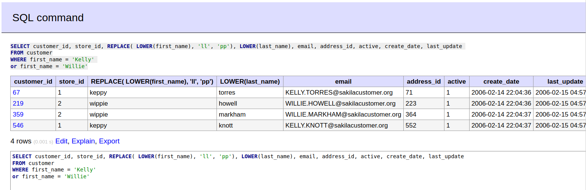
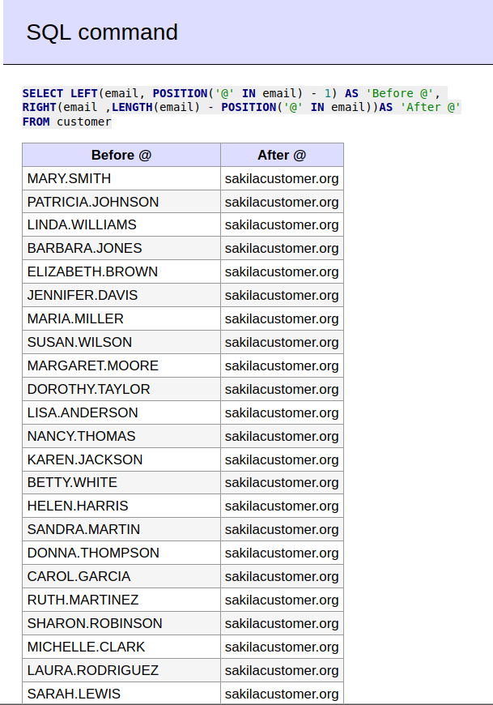
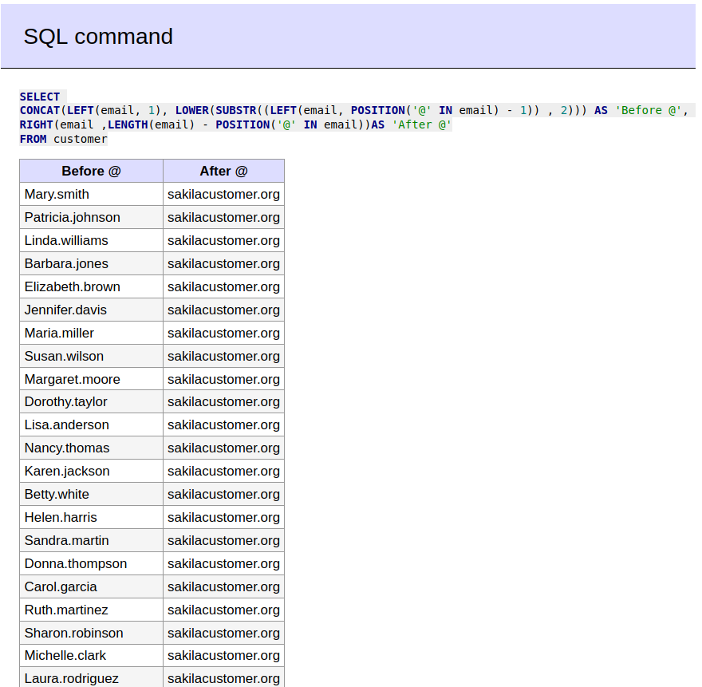

# Домашнее задание к занятию 12.3. «SQL. Часть 1» - Серебряков Руслан 

Задание можно выполнить как в любом IDE, так и в командной строке.

### Задание 1

Получите уникальные названия районов из таблицы с адресами, которые начинаются на “K” и заканчиваются на “a” и не содержат пробелов.

SELECT DISTINCT district
FROM address
WHERE POSITION('K' IN district) = 1 
AND RIGHT(district, 1) = 'a' 
AND POSITION(' ' IN district) = 0
ORDER BY district

### Задание 2

Получите из таблицы платежей за прокат фильмов информацию по платежам, которые выполнялись в промежуток с 15 июня 2005 года по 18 июня 2005 года **включительно** и стоимость которых превышает 10.00.

SELECT *
FROM payment
WHERE CAST(payment_date AS DATE) > '2005-06-15'
AND CAST(payment_date AS DATE) < '2005-06-18'
AND amount > 10.00
ORDER BY CAST(payment_date AS DATE)

---

### Задание 3

Получите последние пять аренд фильмов.

SELECT *
FROM rental
ORDER BY CAST(rental_date AS DATE) DESC
LIMIT 5 

---

### Задание 4

Одним запросом получите активных покупателей, имена которых Kelly или Willie. 

Сформируйте вывод в результат таким образом:
- все буквы в фамилии и имени из верхнего регистра переведите в нижний регистр,
- замените буквы 'll' в именах на 'pp'.

SELECT customer_id, store_id, REPLACE( LOWER(first_name), 'll', 'pp'), LOWER(last_name), email, address_id, active, create_date, last_update 
FROM customer
WHERE first_name = 'Kelly' 
or first_name = 'Willie'

---

## Дополнительные задания (со звёздочкой*)
Эти задания дополнительные, то есть не обязательные к выполнению, и никак не повлияют на получение вами зачёта по этому домашнему заданию. Вы можете их выполнить, если хотите глубже шире разобраться в материале.

### Задание 5*

Выведите Email каждого покупателя, разделив значение Email на две отдельных колонки: в первой колонке должно быть значение, указанное до @, во второй — значение, указанное после @.

SELECT LEFT(email, POSITION('@' IN email) - 1) AS 'Before @', 
RIGHT(email ,LENGTH(email) - POSITION('@' IN email))AS 'After @'
FROM customer

---

### Задание 6*

Доработайте запрос из предыдущего задания, скорректируйте значения в новых колонках: первая буква должна быть заглавной, остальные — строчными.

SELECT 
CONCAT(LEFT(email, 1), LOWER(SUBSTR((LEFT(email, POSITION('@' IN email) - 1)) , 2))) AS 'Before @', 
RIGHT(email ,LENGTH(email) - POSITION('@' IN email))AS 'After @'
FROM customer

